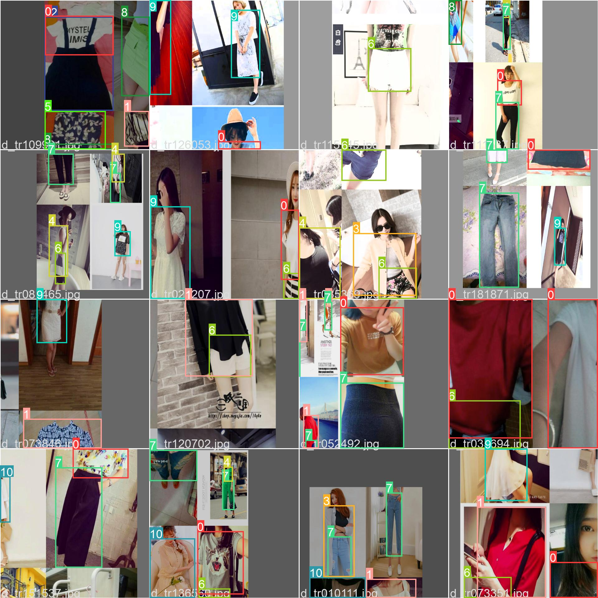
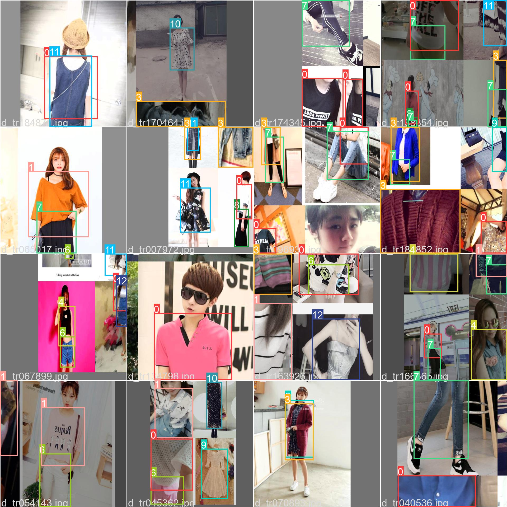
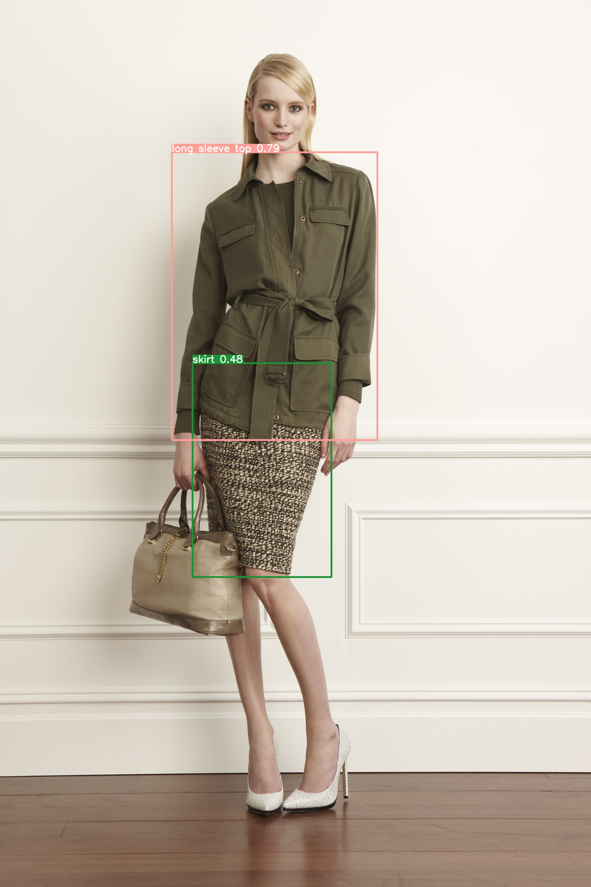
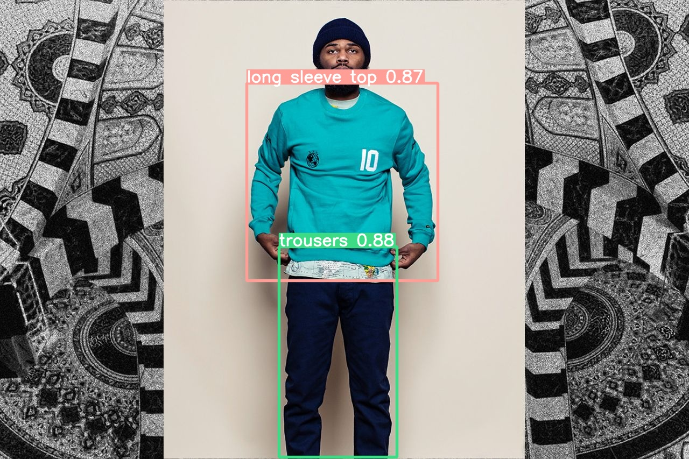

# Clothing detection using YOLOv5 (trained on DeepFashion2 datasets).
## Overview
For following project Deepfashion2 data is used. To use this project download trained weights and put them under the "weights" floder. 
To get the detection run the following command.
>python detect.py --data data/deepfashion.yaml --weights weights/best.pt --source data/IMAGE_FILE
---
## Downloads: Data & Weights
Data can be downloaded from [link](https://github.com/switchablenorms/DeepFashion2).

Trained weights can be downloaded from [link](https://mega.nz/file/01NlUDxA#yn_y8L56_EyEoNHoyw1NkANvbNWr9xKDgS-h6kaguGA).
## Results
Result on validation dataset.
|Precision|Recall|mAP 0.50|mAP 0.5:0.95|
|---|---|---|---|
|80%|71%|75%|65%|

---